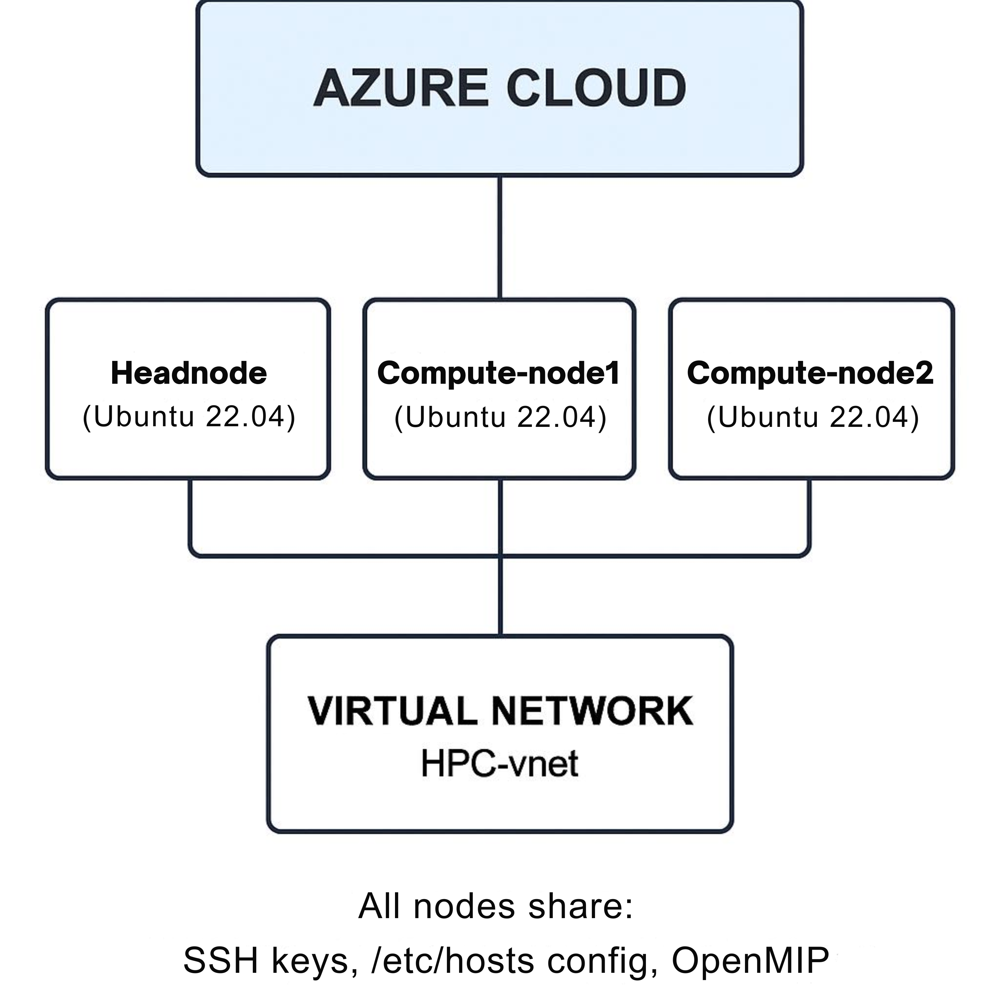
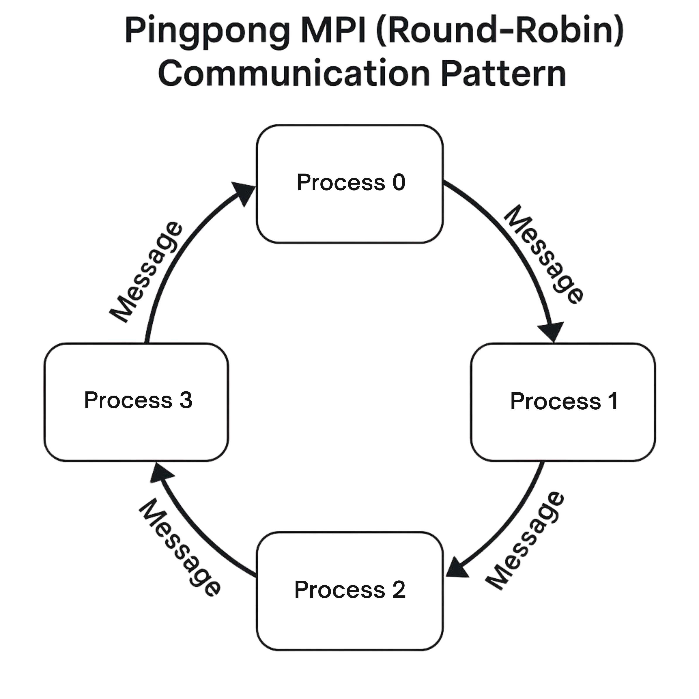
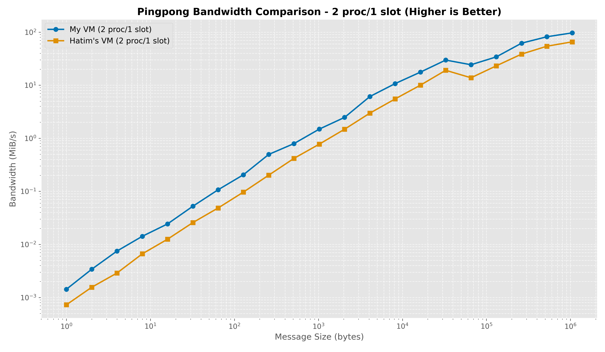
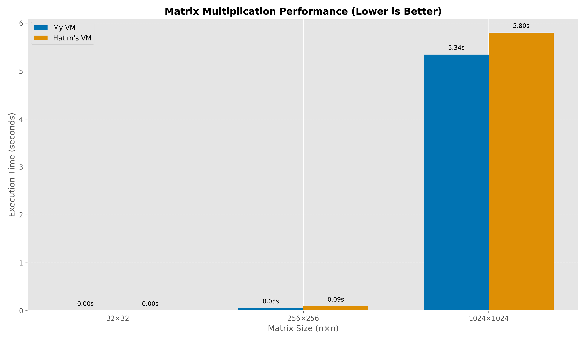
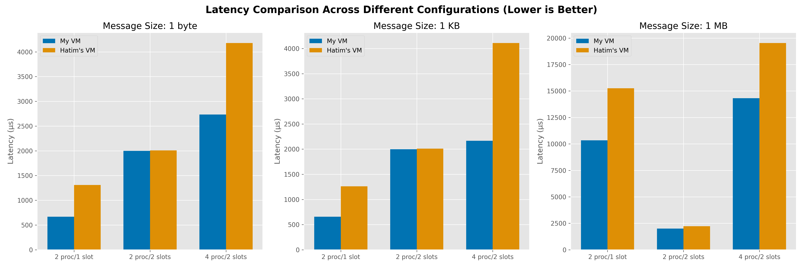
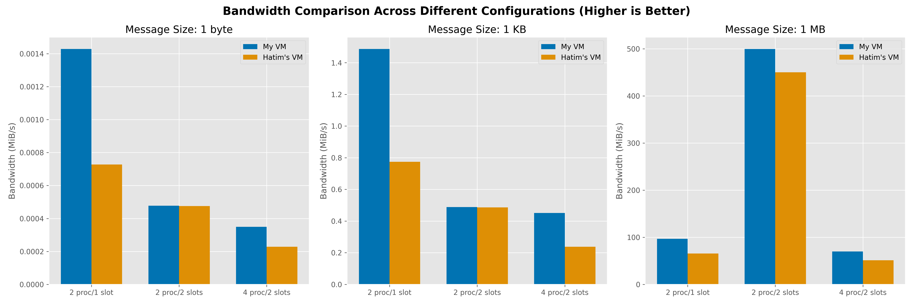
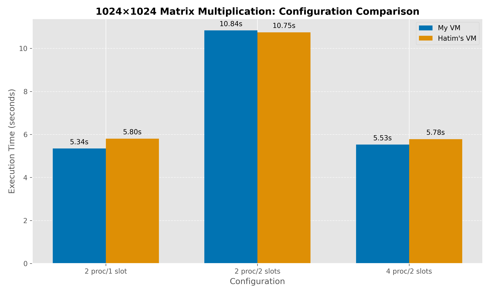

# Cluster and Cloud Benchmarking

> **This repository contains MPI benchmark implementations and analysis for evaluating the performance of cloud-based clusters across different configurations.**

For detailed implementation instructions and complete analysis, refer to the [**full laboratory report**](Laboratory%20report.pdf).

## Overview

This project demonstrates the **deployment and benchmarking** of a virtual computer cluster on Microsoft Azure. The system consists of **three Ubuntu 22.04 nodes** (*one headnode* and *two compute nodes*) connected through a shared virtual network (**HPC-vnet**), using **OpenMPI** for parallel processing.

  

The architecture shown above illustrates how the three nodes communicate through the shared virtual network, with all nodes having access to common resources like **SSH keys**, **host configurations**, and the **OpenMPI middleware**.

---

## Benchmark Applications

### Pingpong Test (Communication Benchmark)

The pingpong benchmark measures **communication performance** by sending messages of varying sizes between processes and recording both:
- **Latency** (round-trip time)
- **Bandwidth** (data transfer rate)

  

As illustrated above, the test implements a **round-robin communication pattern** where each process sends messages to the next process in sequence. This allows us to measure the network performance across different nodes in the cluster.

The results show significant differences in communication performance based on message size and process configuration:

  

> **Key Insight:** The bandwidth comparison reveals that **our VM consistently outperforms the comparison VM** across all message sizes, with the gap widening as message size increases. For large messages (approaching 1MB), we see bandwidth exceeding **100 MiB/s**.

### Matrix Multiplication (Computation Benchmark)

The matrix multiplication benchmark tests **computational performance** by performing matrix-matrix multiplication with different matrix sizes:
- **32×32** (small)
- **256×256** (medium)
- **1024×1024** (large)

  

The results show that execution time scales significantly with size and configuration:

  

> **Key Insight:** While performance is nearly identical for small matrices, **our VM shows a clear advantage with medium and large matrices**. This suggests better CPU performance or memory access patterns in our configuration.

---

## Performance Analysis

We tested **three different cluster configurations** to evaluate both communication and computational performance:

| Configuration | Description | Best Use Case |
|:------------:|:------------|:-------------|
| **p2_s1** | 2 processes with 1 slot per node | Low-latency communication, computation tasks |
| **p2_s2** | 2 processes with 2 slots per node | High-bandwidth communication with large messages |
| **p4_s2** | 4 processes with 2 slots per node | Testing scaling behavior |

### Communication Performance

  

The latency comparison above shows that the **p2_s1 configuration provides the best latency** for small to medium messages, while latency increases significantly for larger messages (1MB). Our VM consistently outperforms the comparison VM across all configurations.

  

For bandwidth performance, the **p2_s2 configuration achieves the highest bandwidth (~500 MiB/s)** for large messages, while small messages show minimal differences between configurations. We observe a **performance threshold at message sizes around 65KB** where bandwidth characteristics change significantly.

### Computational Performance

  

The large matrix (1024×1024) multiplication results above reveal that the **p2_s1 configuration performs best**, completing the task in approximately **5.3 seconds**. Interestingly, adding more processes with the p4_s2 configuration doesn't improve performance, likely due to increased communication overhead.

---

## Key Findings and Conclusion

Our benchmarking results demonstrate that optimal configuration depends on workload characteristics:

- **Communication-intensive applications** with large messages benefit from **p2_s2**
- **Computation-intensive applications** generally perform best with **p2_s1**
- Adding more processes doesn't always improve performance due to **increased communication overhead**

> **These insights can guide optimal cluster configuration based on specific application requirements.**